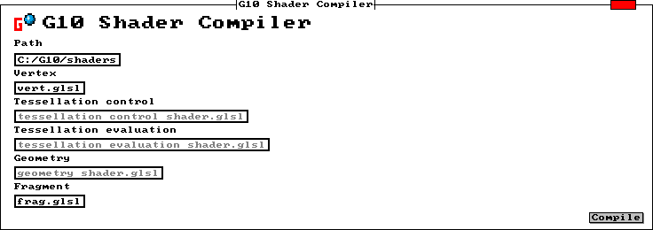

# G10 Shader Compiler

The shader compiler is a simple program for compiling and recompiling shaders. The "path" text box is autofilled when the application starts, using the environment variable ```G10_SOURCE_PATH```. Shader output is placed in the same ```path``` as the source code, with the file extension ```.spv```. 


